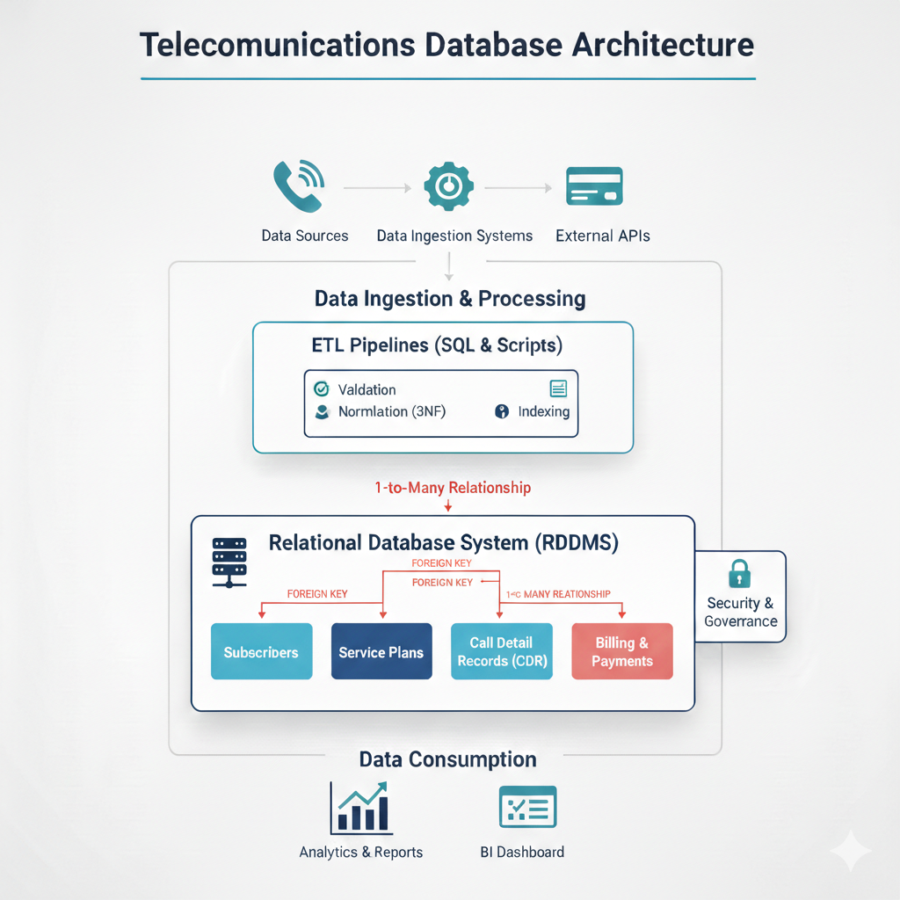

# Telecommunications Database Management System (DBMS)

A robust relational database implementation designed to manage the core operations of a Telecommunications provider. This project focuses on high-performance schema design, data integrity, and complex analytical querying for subscriber management, billing, and network usage tracking.

---

## 📌 Project Overview
In the telecommunications industry, managing the relationship between subscribers, plans, call detail records (CDRs), and billing is a massive data challenge. This project implements a centralized DBMS that enforces strict business rules through relational constraints and provides a foundation for operational reporting and business intelligence.

## 🛠 Tech Stack
* **Database Engine:** PostgreSQL / MySQL (Standard SQL)
* **Modeling:** ER Diagramming (Crow's Foot Notation)
* **Concepts:** 3NF Normalization, Referential Integrity, ACID Properties
* **Tools:** SQL Workbench, DDL/DML Scripting

## 🏗 Database Architecture & Design
The system is built upon a highly normalized schema to eliminate data redundancy and ensure transactional integrity.

  
   
  <em>Database Management System Architecture Diagram</em>

### 1. Core Entities
* **Subscribers 👤:** Master data containing account details, PII, and registration status.
* **Service Plans 📑:** Definitions of prepaid/postpaid offerings, data limits, and pricing tiers.
* **Call Detail Records (CDR) 📞:** High-volume transactional data capturing call origin, destination, duration, and timestamps.
* **Billing & Payments 💳:** Tracking monthly invoices, payment methods, and account balances.

### 2. Relational Integrity (Foreign Keys)
The architecture ensures data consistency through strictly defined relationships:
* **Subscriber ↔ Service Plan:** A **One-to-Many** relationship where each subscriber is linked to a specific plan via `Plan_ID`.
* **Subscriber ↔ CDR:** A **One-to-Many** relationship where each call record is tied to a specific `Subscriber_ID`.
* **Subscriber ↔ Billing:** A **One-to-Many** relationship connecting invoices and payments to the primary account holder.

## 🚀 Key SQL Implementations

### 🌐 Complex Analytical Queries
The repository contains optimized SQL scripts for critical business insights:
* **Churn Analysis:** Identifying subscribers with decreasing usage patterns over a 90-day window using `JOIN` and `GROUP BY`.
* **Revenue Per User (ARPU):** Aggregating billing data to calculate average revenue across different service plans.
* **Usage Ranking:** Utilizing `Window Functions` (e.g., `RANK()`, `OVER()`) to identify high-value customers by data consumption.

### 🛡️ Data Governance
* **Normalization (3NF):** The schema is decomposed to 3rd Normal Form to prevent update and insertion anomalies.
* **Data Validation:** Extensive use of `PRIMARY KEY`, `FOREIGN KEY`, and `CHECK` constraints to automate data validation at the database level.
* **Abstraction:** Implementation of `VIEWS` to provide restricted access to sensitive subscriber data for different organizational roles.

## 📊 Methodology
1.  **Conceptual Design:** Developed the ER Diagram to visualize complex many-to-many and one-to-many relationships.
2.  **Logical Mapping:** Translated the ERD into relational tables with optimized data types.
3.  **Physical Implementation:** Executed DDL scripts to build the structure and DML scripts to populate sanitized data.
4.  **Performance Tuning:** Strategic indexing on `Subscriber_ID` and `Transaction_Date` to optimize join performance and query response times.

---
*Developed by [Chinmay Kulkarni](https://github.com/ckulkarni13)*
